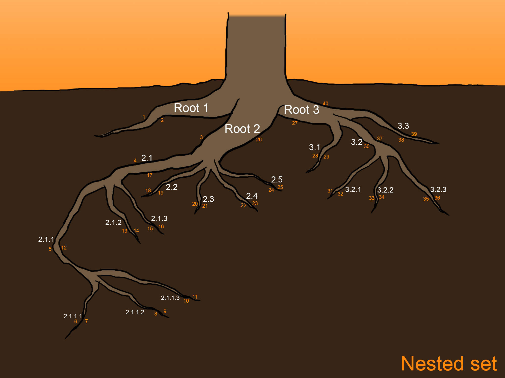

# NestedSet

The PHP nested set model for create/read/update/delete the tree data structure (hierarchy).

[](https://packagist.org/packages/rundiz/nested-set)
[](https://packagist.org/packages/rundiz/nested-set)
[](https://packagist.org/packages/rundiz/nested-set)



A class that help you to query complex data of nested set.

## Example

### Install
I recommend you to install this library via Composer and use Composer autoload for easily include the file. If you are not using Composer, you have to manually include the file by yourself.<br>
Please make sure that the path to files are correct.
```php
include_once '/path/to/Rundiz/src/NestedSet.php';
```

If you want to make sure or see how class is working please following the step below, otherwise skip this step.<br>
Import **tests/common/test-database-structure.sql** file to the database.

---

### Connect to DB
This class is using PDO class. Please connect to PDO and send the `\PDO` object to the class constructor.
```php
$db['dsn'] = 'mysql:dbname=YOUR_DB_NAME;host=localhost;port=3306;charset=UTF8';
$db['username'] = 'admin';
$db['password'] = 'pass';
$db['options'] = [
    \PDO::ATTR_ERRMODE => \PDO::ERRMODE_EXCEPTION // throws PDOException.
];
$PDO = new \PDO($dbConfig['dsn'], $dbConfig['username'], $dbConfig['password'], $dbConfig['options']);
$NestedSet = new \Rundiz\NestedSet\NestedSet($PDO);
$NestedSet->tableName = 'test_taxonomy';// this should be your table name but you can use this for testing.
```

---

### Insert the data
Before insert, you can get new position of that taxonomy level using `getNewPosition()` method.
```php
$new_position = $NestedSet->getNewPosition(4);// result is 4.
```

Everytime you insert the data, you have to run `rebuild()` method to generate level, left, right data. The incorrect level, left, right data can cause incorrect listing.
```php
$stmt = $PDO->prepare('INSERT INTO `test_taxonomy`(`parent_id`, `name`, `position`) VALUES (?, ?, ?)');
$stmt->execute([0, 'Root 4', 4]);
$NestedSet->rebuild();
```

---

### Update the data
To update the data, you don't need new position for this but you have to run `rebuild()` method every time.
```php
$stmt = $PDO->prepare('UPDATE `test_taxonomy`SET `name` = ?, `position` = ? WHERE `id` = ?;
$stmt->execute(['Root 4 new name', 4, 21]);
$NestedSet->rebuild();
```

#### Check parent under children
If you want to change the parent of selected item, you can check first that the new parent of selected item is under children of selected item or not.<br>
You can use `isParentUnderMyChildren()` method to check this and `false` means correct parent (new parent is not children of editing item).<br>
To continue on this please use the data in **demo-data.sql** file.
```php
$editing_item_id = 9;
$new_parent_id = 7;
var_dump($NestedSet->isParentUnderMyChildren($editing_item_id, $new_parent_id));// false (CORRECT! the new parent is not child of this item)

$new_parent_id = 14;
var_dump($NestedSet->isParentUnderMyChildren($editing_item_id, $new_parent_id));// true (INCORRECT! the new parent is child of this item)
```

---

### Read the data
To read the selected item data with its children, you can use `getTaxonomyWithChildren()` method.
```php
$options['filter_taxonomy_id'] = 3;// The selected item ID.
$list_txn = $NestedSet->getTaxonomyWithChildren($options);
unset($options);
print_r($list_txn);
```

To read the selected item data with its parent in a line until root item, you can use `getTaxonomyWithParents()` method.
```php
$options['filter_taxonomy_id'] = 13;// The selected item ID.
$list_txn = $NestedSet->getTaxonomyWithParents($options);
unset($options);
print_r($list_txn);
```

### List the items
You can list the items by use `listTaxonomy()` method for nested array data or use `listTaxonomyFlatten()` for flatten data.
```php
$options = [];
$options['unlimited'] = true;
$list_txn = $NestedSet->listTaxonomy($options);
unset($options);
// The variable $list_txn is array and have 2 keys (total, items).
```
Both methods parameters are same.

---

### Delete an item
You can choose how to delete an item.

1. Delete selected item and ALL of its children.
2. Delete selected item and pull up its children to the current parent.

Every time you deleted, you have to run the `rebuild()` method to correct level, left, right data.

Delete selected item and ALL of its children.
```php
$NestedSet->deleteWithChildren(16);
$NestedSet->rebuild();
```

Delete selected item and pull up its children to the current parent.
```php
$NestedSet->deletePullUpChildren(9);
$NestedSet->rebuild();
```

For more example including complex conditions which is new feature since v 1.x, please take a look in **tests/phpunit** folder or the API document in **.wiki/apidoc** folder.
